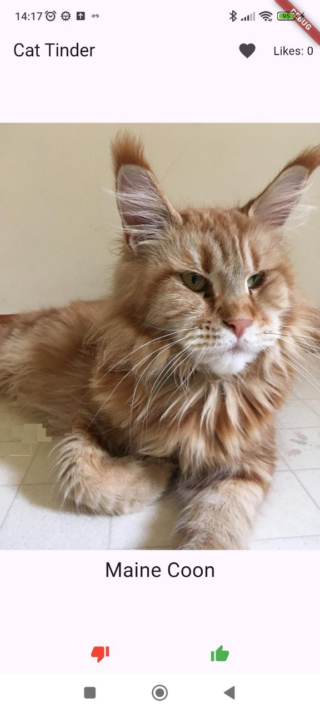
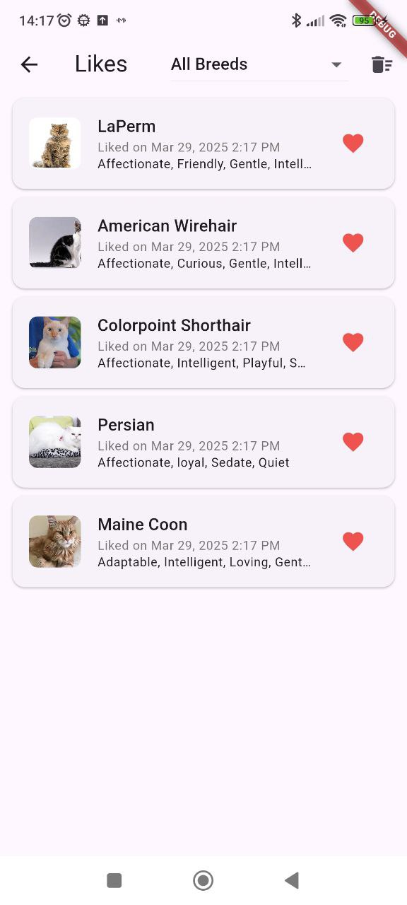
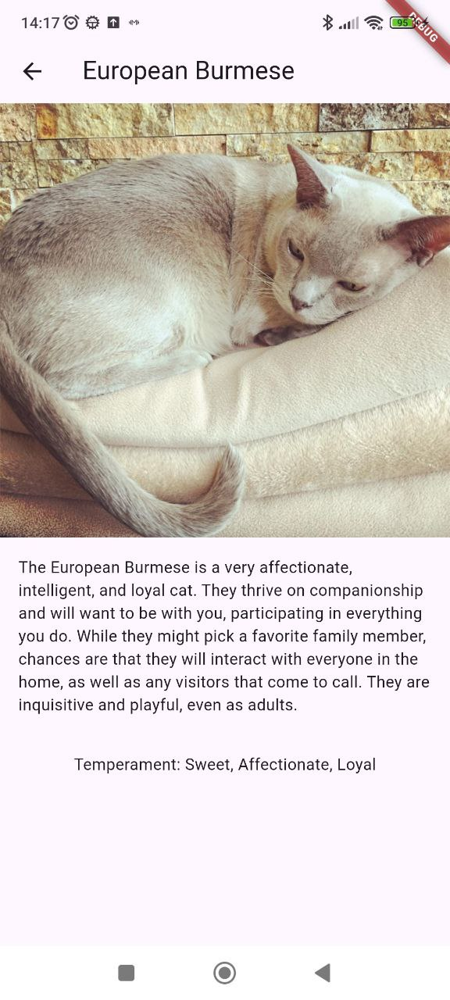
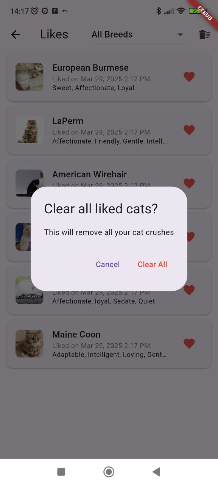
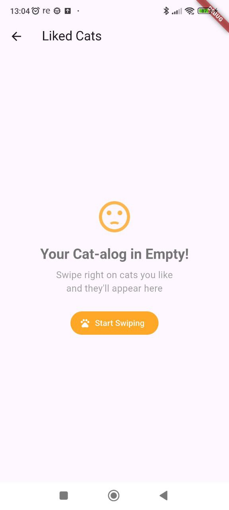
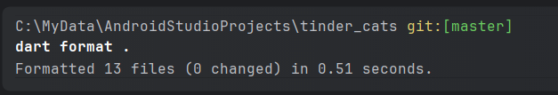
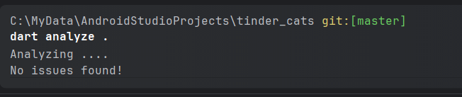
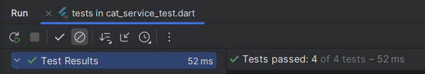
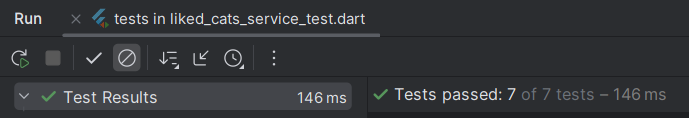

# Tinder для котиков 🐱❤️

Приложение представляет собой анализ Tinder, но с фотографиями коток и кошек, где можно свайпать вправо (лайк) или влево (пропуск), с возможностью сохранения понравившихся питомцев.

## 📱 Скриншоты приложения

  
   
  
  
  
  
  

## 🌟 Основные функции

### Механика приложения
- **Свайпинг**: Жесты влево/вправо или кнопки для лайков
- **Карточки котов**: Фото, порода, описание характера
- **Избранное**: Все понравившиеся коты в одном месте

### Работа с избранными
- 💾 **Сохранение**: Лайкнутые коты остаются в памяти приложения
- ⏱ **Дата**: Отметка времени когда кот был лайкнут
- 🔍 **Фильтрация**: Сортировка по породам
- 🗑 **Удаление**: Можно убрать из избранного

### Технические особенности
- ⏳ **Таймауты**: Защита от зависаний (3 сек на загрузку)
- 📶 **Оффлайн-режим**: Приложение поддерживает оффлайн-режим. При отсутствии интернета пользователю показывается уведомление, но интерфейс остается отзывчивым.
- 💾 **Кеширование**: Фото котов кешируются, чтобы они могли отображаться без подключения к сети.
- ♻️ **Повторные попытки**: Автоматический ретрай при ошибках сети
- ❤️ **Сохранение лайков и дизлайков**: Все лайкнутые и дизлайкнутые коты сохраняются в локальной памяти приложения для дальнейшего использования.

## 📦 Технологии

### Используемые пакеты
| Пакет | Назначение |
|-------|------------|
| cached_network_image | Кеширование фото |
| connectivity_plus | Проверка сети |
| get_it | Внедрение зависимостей |
| http | Работа с API |
| intl | Форматирование дат |

### Архитектура

Проект разбит на 3 слоя: data, domain и presentation, с вынесением вспомогательных классов в отдельные папки:
- di для Dependency Injection: реализовано через Locator, создающий зависимости через GetIt, и вспомогательный Injector, упрошающий получение зависимости.
- utils для утилитных функций, например проверка интернет-соединения.

## Ссылка на скачивание
Ссылка на APK под разные архитектуры устройств: https://github.com/FismanMaxim/MIPT_Flutter_Homework1/releases/tag/apk

## 🚀 Планы по развитию
- Система аккаунтов
- Продвинутая фильтрация
- Локальная база данных

## ⚠️ Известные проблемы
Окно загрузки фото после свайпа
Отсутствие анимации свайпа (она не требовалась по заданию)

### Код проходит format без исправлений:

### Код проходит analyze без замечаний:

### Все тесты проходят:

