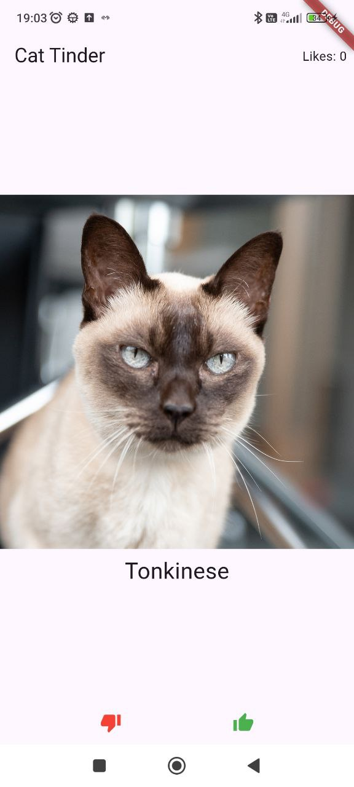

# tinder_cats

Учебный проект по предмету "Flutter".

Приложение представляет собой аналог Tinder, но с фотографиями кошек.
На главном экране отображается случайное изображение кота или кошки с указанием породы.
Его можно свайпнуть влево или вправо, либо нажать на кнопку лайка/дизлайка, и перейти к следующему изображению.
В верхнем правом углу указан счетчик лайков.
При нажатии на конкретное изображение, открывается экран с детальной информацией по этой породе.

Реализованные фичи из технических требований:
1) отображение слчайного котика
2) Изображение можно свайпнуть влево-вправо
3) Кнпки лайк/дилзайк
4) Смена котика при свайпе/смахе/нажатии кнопки
5) Счетчик лайков
6) Экран с детальным описанием
7) Информация о породе на экране с детальным описанием

Примеры изображения интерфейса приложения:

Ссылки:
ссылка на репозиторий: https://github.com/FismanMaxim/MIPT_Flutter_Homework1
ссылка непосредственно на apk: 